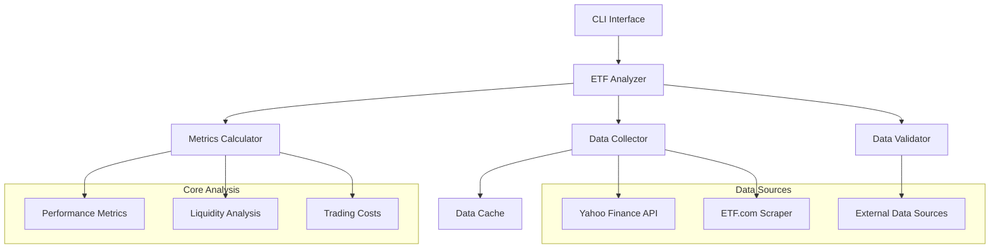
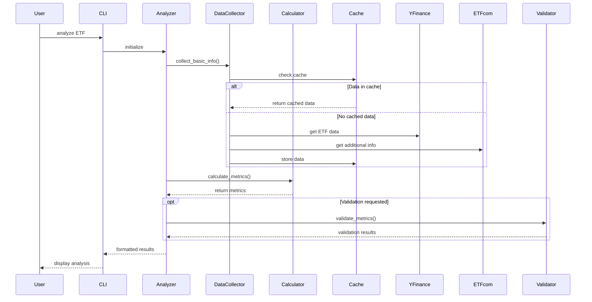
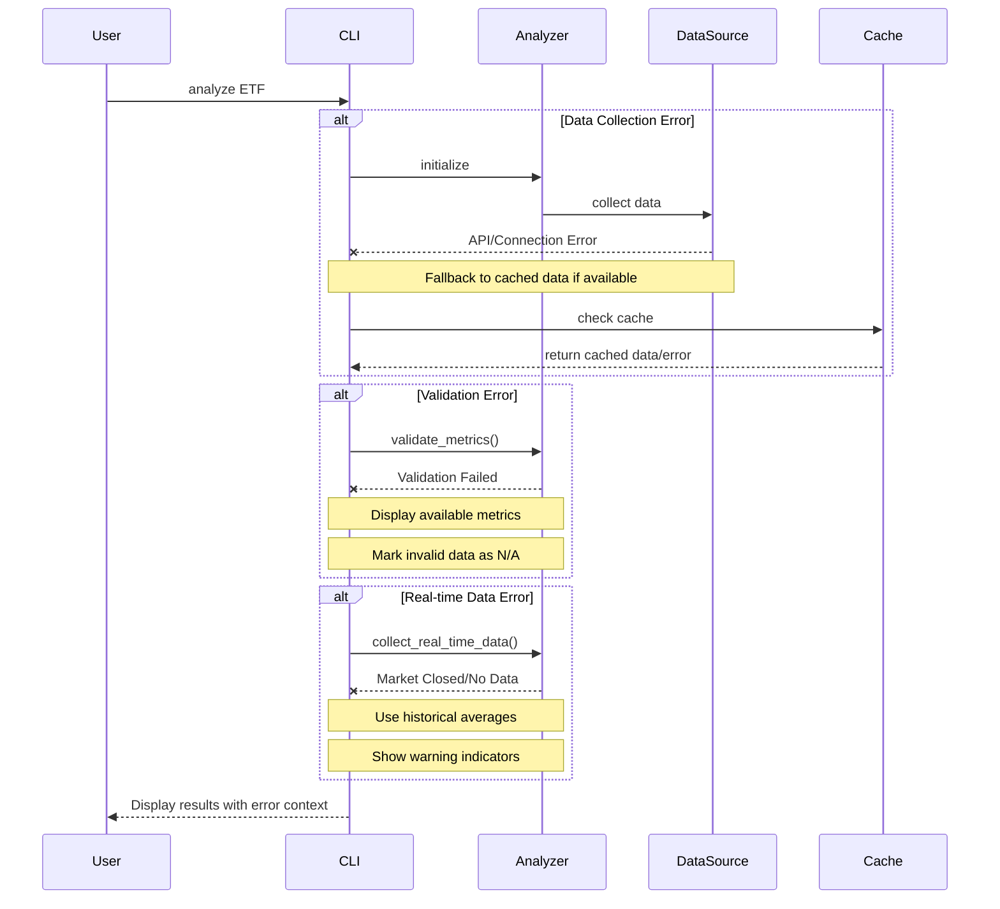

# ETFA (ETF Analyzer)

A command-line tool for analyzing and comparing ETFs with a focus on liquidity, trading costs, and performance metrics.

## Features

- Basic ETF information and metrics
- Performance analysis with benchmark comparison
- Liquidity scoring and trading cost analysis
- Data validation against external sources
- Historical performance tracking
- Multi-ETF comparison

## Installation

1. Create and activate virtual environment:
```bash
# Create virtual environment
python -m venv etfa

# Activate on Unix/macOS
source etfa/bin/activate

# Activate on Windows
.\etfa\Scripts\activate
```

2. Install the package:
```bash
# Install in development mode
pip install -e .
```

## Resetting Environment

If you need to reset your environment:
```bash
# Deactivate current environment
deactivate

# Remove old environment
rm -rf etfa/

# Create fresh environment
python -m venv etfa
source etfa/bin/activate  # or .\etfa\Scripts\activate on Windows

# Reinstall package
pip install -e .
```

## Usage

### Basic Analysis
```bash
etfa analyze SPY
```
Shows basic ETF information and performance metrics.

### Single ETF Analysis Options
```bash
etfa analyze SPY [OPTIONS]

Options:
  --benchmark TEXT  Benchmark ETF ticker (default: SPY)
  --verbose        Show detailed liquidity analysis
  --validate      Compare with external data sources
  --history       Show historical performance metrics
  --costs         Show trading cost breakdown
```

### Compare Multiple ETFs
```bash
etfa compare SPY IVV VOO [OPTIONS]

Options:
  --costs    Include trading cost comparison
```

### Command Differences

- `analyze`: Deep dive into a single ETF
  - Detailed metrics and analysis
  - Historical performance
  - Trading costs for the ETF
  - Validation against external sources
  - Liquidity score breakdown

- `compare`: Side-by-side comparison of multiple ETFs
  - Basic metrics for all ETFs
  - Relative performance
  - Trading cost differences
  - Quick decision making

## Metrics Explained

### Basic Metrics
- **AUM (Assets Under Management)**: Total value of assets in the ETF. Higher AUM generally indicates better liquidity and lower tracking error.
- **Average Daily Volume**: Trading volume averaged over recent history. Higher volume suggests better liquidity and tighter spreads.
- **Expense Ratio**: Annual management fee. Lower is better, but consider alongside tracking error.

### Trading Metrics
- **Bid/Ask Spread**: Current difference between best bid and ask prices. Lower spreads indicate better liquidity.
- **Spread %**: Spread as percentage of price. <0.1% is excellent, >0.5% needs caution.
- **Market Impact**: Estimated price movement from large trades. Lower is better.
  - Small Impact: <0.1% for trades <1% ADV
  - Medium Impact: 0.1-0.3% for trades 1-5% ADV
  - Large Impact: >0.3% for trades >5% ADV

### Performance Metrics
- **Volatility (Annualized)**: Standard deviation of returns, annualized. Measures price variability and risk.
- **Tracking Error**: Difference between ETF and benchmark returns. Lower values indicate better index replication.
- **Sharpe Ratio**: Risk-adjusted return measure. Higher values indicate better risk-adjusted performance.
- **Max Drawdown**: Largest peak-to-trough decline. Measures downside risk.

### Liquidity Score Components (0-100)
- **Volume Score (40 points)**:
  - Daily volume consistency
  - Volume relative to peers
  - Volume trend analysis
- **Spread Score (30 points)**:
  - Current spread tightness
  - Spread stability
  - Market maker participation
- **Asset Score (30 points)**:
  - AUM size and stability
  - Creation/redemption activity
  - Market impact resistance

### Trading Costs (available in compare --costs)
- **Explicit Costs**:
  - Expense Ratio
  - Commission (if applicable)
- **Implicit Costs**:
  - Spread Cost (half the bid-ask spread)
  - Market Impact Cost
- **Total Trading Costs**:
  - One-Way: Cost for single direction trade
  - Round-Trip: Complete in-and-out trade cost

Note: Trading cost analysis is available when comparing ETFs using the `compare` command with the `--costs` flag.

## Validation

The `--validate` flag compares key metrics against external sources:
- Expense Ratio: Checked against fund provider data
- AUM: Compared with recent filings
- Volume: Verified against market data

Color coding indicates discrepancy severity:
- 🟢 Green: Minor difference (<1% for expense ratio, <10% for AUM, <15% for volume)
- 🟡 Yellow: Moderate difference
- 🔴 Red: Significant difference (requires investigation)

## Historical Analysis

The `--history` flag shows metrics over multiple periods:
- 1 month
- 3 months
- 6 months
- 1 year

## Using Metrics for ETF Analysis

### Liquidity Assessment
1. Check Average Daily Volume: >$10M for good liquidity
2. Review Liquidity Score: >80 indicates excellent tradability
3. Examine bid-ask spreads: <0.1% preferred for large ETFs

### Cost Efficiency
1. Compare Expense Ratios within similar ETFs
2. Consider Total Cost of Ownership:
   - Expense Ratio
   - Trading Costs
   - Tracking Error impact

### Performance Evaluation
1. Compare Tracking Error to similar ETFs
2. Assess Risk-Adjusted Returns (Sharpe Ratio)
3. Review Max Drawdown for downside protection

### Best Practices
- Compare similar ETFs using the compare command
- Validate data when analyzing unfamiliar ETFs
- Consider trading costs for your typical trade size
- Monitor historical trends for stability

## Contributing

Contributions welcome! Please read CONTRIBUTING.md for guidelines.

## License

MIT License - see LICENSE.md

## Architecture



## Data Flow



## Error Handling Flow



## Implementation Notes

### Data Collection
- **Caching Strategy**:
  ```python
  # Example cache implementation
  class ETFDataCache:
      def get(self, key: str) -> dict:
          if self._is_expired(key):
              return None
          return self._cache.get(key)
      
      def set(self, key: str, data: dict):
          data['timestamp'] = time.time()
          self._cache[key] = data
  ```

### Error Handling
- **Graceful Degradation**:
  ```python
  try:
      real_time_data = collect_real_time_data()
  except ConnectionError:
      real_time_data = estimate_from_historical()
  except MarketClosedError:
      real_time_data = get_last_known_values()
  ```

### Data Validation
- **Threshold Configuration**:
  ```python
  VALIDATION_THRESHOLDS = {
      'expense_ratio': {'warn': 0.0005, 'error': 0.001},
      'aum': {'warn': 0.10, 'error': 0.25},
      'volume': {'warn': 0.15, 'error': 0.30}
  }
  ```

### Performance Optimization
- Cache frequently accessed data
- Batch API requests when possible
- Use async calls for real-time data
- Implement rate limiting for external APIs

### Best Practices
1. **Data Collection**:
   - Always validate API responses
   - Implement retry logic with backoff
   - Keep cache duration appropriate to data type

2. **Error Recovery**:
   - Log all errors with context
   - Provide meaningful user feedback
   - Maintain data consistency during partial failures

3. **Validation**:
   - Cross-reference multiple sources
   - Track validation success rates
   - Alert on systematic validation failures

4. **Real-time Analysis**:
   - Handle market hours correctly
   - Account for trading halts
   - Consider timezone differences

