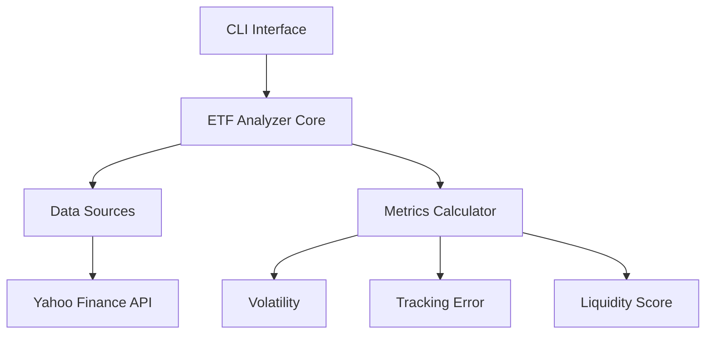
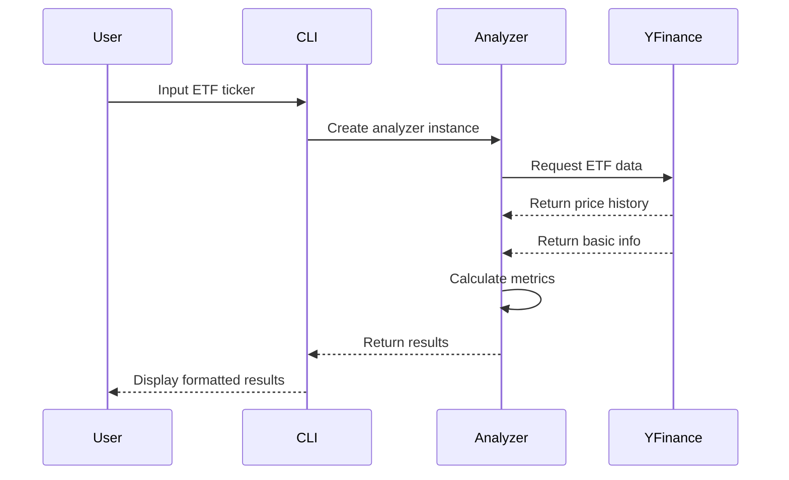
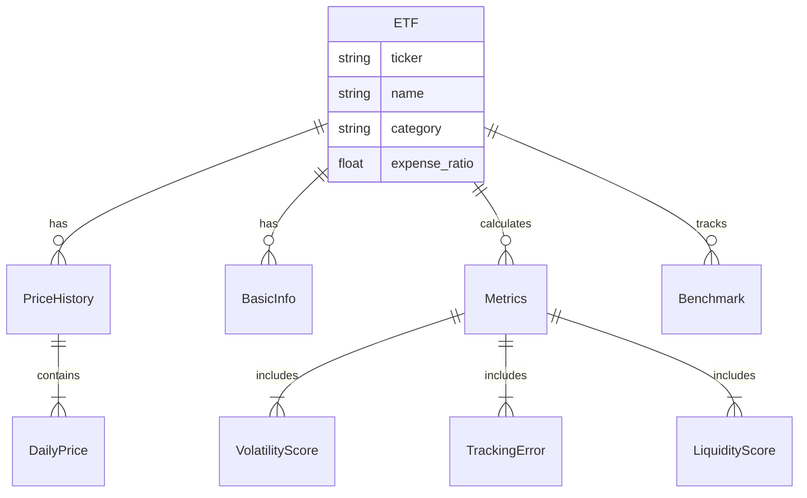

# ETF Analyzer

A Python package for analyzing Exchange-Traded Funds (ETFs), providing tools for gathering data, analyzing performance, and calculating key metrics.

## Installation

### Initial Setup
1. Clone the repository:
```bash
git clone https://github.com/yourusername/etf-analyzer.git
cd etf-analyzer
```

2. Create and activate a virtual environment:
```bash
# Create virtual environment
python3 -m venv etfa

# Activate virtual environment
# On macOS/Linux:
source etfa/bin/activate
# On Windows:
etfa\Scripts\activate
```

3. Install the package:
```bash
# Install dependencies
pip install -r requirements.txt

# Install package in development mode
pip install -e .
```

### Browser Automation Setup

The ETF analyzer uses browser automation for enhanced data collection. Follow these steps based on your operating system:

#### macOS
1. Install Chrome and ChromeDriver:
```bash
# Using Homebrew
brew install --cask chromium
brew install chromedriver
```

2. Remove security quarantine:
```bash
# Allow ChromeDriver
xattr -d com.apple.quarantine /opt/homebrew/bin/chromedriver

# If using Chrome, also allow it
xattr -d com.apple.quarantine /Applications/Google\ Chrome.app
```

3. Additional Security Steps:
   - Go to System Preferences > Security & Privacy > General
   - Look for messages about ChromeDriver being blocked
   - Click "Allow Anyway"

#### Ubuntu/Debian
```bash
# Install Chrome and ChromeDriver
sudo apt install chromium-browser chromium-chromedriver
```

#### Windows
1. Download and install Chrome from google.com/chrome
2. Download ChromeDriver from https://sites.google.com/chromium.org/driver/
3. Add ChromeDriver to your system PATH

### Updating the Package
If you've made changes to the code or pulled updates:

1. Ensure your virtual environment is activated:
```bash
source etfa/bin/activate  # macOS/Linux
etfa\Scripts\activate     # Windows
```

2. Uninstall current version:
```bash
pip uninstall etf-analyzer
```

3. Reinstall the updated version:
```bash
pip install -e .
```

4. (Optional) Update dependencies:
```bash
pip install -r requirements.txt --upgrade
```

## Architecture



## Data Flow



## Entity Relationship



## Data Sources

### 1. Yahoo Finance API
The project uses the `yfinance` library to fetch ETF data from Yahoo Finance. This provides:
- Historical price data
- Trading volume
- Basic ETF information
- Expense ratios
- Assets under management (when available)

### 2. ETF.com Integration
The analyzer includes web scraping capabilities for ETF.com, providing:
- Expense ratio validation
- AUM (Assets Under Management)
- Average daily volume
- Number of holdings
- Segment/category information
- Issuer details

### Data Management Features

#### Rate Limiting
- Respects server limits (10 requests/minute)
- Automatic request throttling
- Prevents API/server overload

#### Caching System
- 24-hour cache for ETF.com data
- Local cache storage in `.cache` directory
- Automatic cache invalidation
- Reduces server load and improves performance

### Data Reliability
- Multiple source validation
- Cross-reference between Yahoo Finance and ETF.com
- Error handling for service outages
- Automatic fallback to cached data

## Calculations and Metrics

### 1. Volatility
```python
volatility = price_data.std() * np.sqrt(252)  # Annualized
```
- Measures price variation using standard deviation
- Annualized by multiplying by sqrt(252) trading days
- Higher values indicate more price uncertainty
- Typical range: 10-30% for most ETFs

### 2. Tracking Error
```python
return_differences = etf_returns - benchmark_returns
tracking_error = return_differences.std() * np.sqrt(252)
```
- Measures how closely ETF follows its benchmark
- Lower values indicate better benchmark tracking
- Typical range: 0.1-2% for index ETFs

### 3. Liquidity Score (0-100)
Combines three components:
1. Volume Score (40%):
   ```python
   volume_score = min(40, (avg_volume / 1000000) * 4)
   ```
   - Higher trading volume = better liquidity
   - 4 points per million shares traded

2. Spread Score (30%):
   ```python
   spread_score = max(0, 30 - spread_percentage * 10)
   ```
   - Tighter spreads = lower trading costs
   - Uses high-low range as spread proxy

3. Asset Base Score (30%):
   ```python
   asset_score = min(30, (assets / 1000000000) * 3)
   ```
   - Larger funds typically more liquid
   - 3 points per billion in assets

## Interpreting Results

### Volatility
- <15%: Low volatility, suitable for conservative investors
- 15-25%: Moderate volatility, typical for broad market ETFs
- >25%: High volatility, may require risk tolerance

### Tracking Error
- <0.5%: Excellent benchmark tracking
- 0.5-1%: Good tracking, typical for most index ETFs
- >1%: High tracking error, may indicate active management

### Liquidity Score
- 80-100: Highly liquid, suitable for all traders
- 50-80: Moderately liquid, watch trading costs
- <50: Limited liquidity, use limit orders

## Usage Examples

### Basic Analysis
```bash
etf-analyzer analyze VOO
```

### Advanced Analysis
```bash
# Show detailed breakdown of metrics
etf-analyzer analyze VOO --verbose

# Compare with ETF.com data
etf-analyzer analyze VOO --validate

# Compare different data providers
etf-analyzer analyze VOO --sources

# Show historical metrics
etf-analyzer analyze VOO --history

# Combine options
etf-analyzer analyze VOO --verbose --validate --history
```

### Comparison Analysis
```bash
etf-analyzer compare VOO SPY QQQ
```

### Custom Benchmark
```bash
etf-analyzer analyze QQQ --benchmark SPY
```

## Validation Methods

### External Data Sources
The analyzer validates metrics against multiple sources:
1. ETF.com
2. Yahoo Finance API
3. Fund provider websites

### Metric Validation
Each metric is validated using:
- Multiple data sources
- Different calculation methods
- Historical consistency checks

### Validation Metrics
| Metric | Validation Method | Typical Difference |
|--------|------------------|-------------------|
| Expense Ratio | Provider websites | < 0.01% |
| Volatility | Multiple timeframes | < 2% |
| Tracking Error | Rolling windows | < 0.5% |
| Liquidity | Market depth data | Varies |

### Interpreting Validation Results
- **Small Differences** (<1%): Normal variation in calculation methods
- **Medium Differences** (1-5%): Investigate data sources
- **Large Differences** (>5%): Potential data issues

## Data Sources Comparison

### Primary Sources
1. **Yahoo Finance (yfinance)**
   - Real-time and historical prices
   - Basic ETF information
   - Trading volume

2. **ETF.com**
   - Expense ratios
   - Fund details
   - Holdings information

3. **Provider Websites**
   - Official expense ratios
   - Detailed holdings
   - Fund documentation

### Source Reliability
| Source | Pros | Cons |
|--------|------|------|
| yfinance | Real-time, Free | API limitations |
| ETF.com | Comprehensive | Web scraping needed |
| Providers | Authoritative | Different formats |

## Best Practices

1. Trading Considerations
   - Use limit orders for ETFs with low liquidity scores
   - Consider trading during market hours for better pricing
   - Monitor tracking error for index-based strategies

2. Analysis Tips
   - Compare similar ETFs before investing
   - Consider expense ratios alongside tracking error
   - Monitor liquidity for large positions

3. Risk Management
   - Use volatility metrics for position sizing
   - Consider correlation with existing holdings
   - Monitor tracking error for index-based strategies

## Contributing

1. Fork the repository
2. Create your feature branch (`git checkout -b feature/amazing-feature`)
3. Commit your changes (`git commit -m 'Add some amazing feature'`)
4. Push to the branch (`git push origin feature/amazing-feature`)
5. Open a Pull Request

## License

This project is licensed under the MIT License - see the [LICENSE](LICENSE) file for details.

## Data Sources and Validation

### Primary Data Sources
1. **ETF.com (Primary)**
   - Expense ratios (most accurate)
   - AUM data
   - Trading volume
   - Holdings information
   - Segment/category data

2. **Yahoo Finance (Secondary)**
   - Historical price data
   - Basic ETF information
   - Trading metrics
   - Fallback data source

### Data Collection Features
- Rate limiting (5 requests/minute)
- 24-hour data caching
- Multiple source validation
- Automatic fallback sources
- Debug logging options

### Validation Process
1. **Expense Ratio Validation**
   - Primary: ETF.com scraping
   - Secondary: Yahoo Finance API
   - Fallback: Provider websites
   - Tolerance: 0.01% difference

2. **AUM Validation**
   - Multiple source comparison
   - Date-aware validation
   - Tolerance: 10% difference

3. **Volume Validation**
   - Rolling average comparison
   - Market condition awareness
   - Tolerance: 15% difference

### Error Handling
- Automatic retry logic
- Graceful degradation
- Multiple fallback sources
- Detailed error reporting
- Debug mode for troubleshooting

