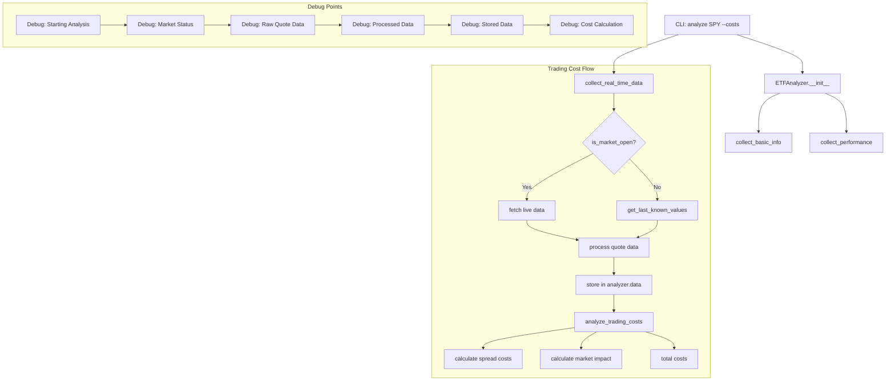
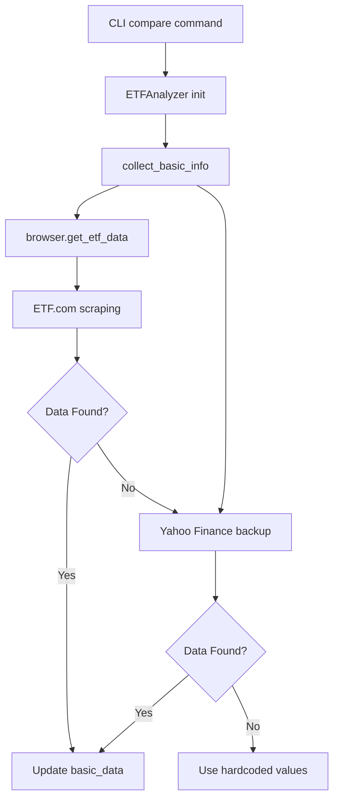

```mermaid
graph TD
    A[CLI: analyze SPY --costs] --> B[ETFAnalyzer.__init__]
    B --> C[collect_basic_info]
    B --> D[collect_performance]
    
    subgraph Trading Cost Flow
        E[collect_real_time_data] --> F{is_market_open?}
        F -->|Yes| G[fetch live data]
        F -->|No| H[get_last_known_values]
        G --> I[process quote data]
        H --> I
        I --> J[store in analyzer.data]
        J --> K[analyze_trading_costs]
        K --> L[calculate spread costs]
        K --> M[calculate market impact]
        K --> N[total costs]
    end
    
    A --> E
    
    subgraph Debug Points
        DP1[Debug: Starting Analysis] --> DP2[Debug: Market Status]
        DP2 --> DP3[Debug: Raw Quote Data]
        DP3 --> DP4[Debug: Processed Data]
        DP4 --> DP5[Debug: Stored Data]
        DP5 --> DP6[Debug: Cost Calculation]
    end
```

```mermaid
graph TD
    A[CLI compare command] --> B[ETFAnalyzer init]
    B --> C[collect_basic_info]
    C --> D[browser.get_etf_data]
    D --> E[ETF.com scraping]
    C --> F[Yahoo Finance backup]
    
    E --> G{Data Found?}
    G -->|Yes| H[Update basic_data]
    G -->|No| F
    
    F --> I{Data Found?}
    I -->|Yes| H
    I -->|No| J[Use hardcoded values]
```

